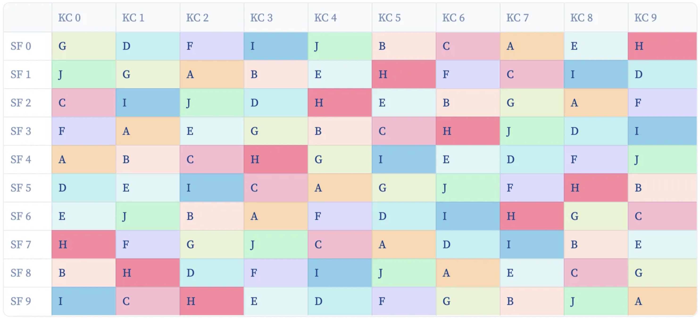

# superbowl-squares

For more information about this project, please read the corresponding [Towards Data Science article](https://medium.com/towards-data-science/optimizing-super-bowl-squares-with-linear-programming-c33cc09ad0f8).

The purpose of this project is to create a competitively fair Super Bowl squares grid for groups of friends and families who would like to engage in a little purely luck-based betting action as they watch the game.

The solution was implemented by representing the matrix / grid as a linear programming problem to be optimized in the same way that sudoku can be written as an integer programming problem.

The general optimization constraints can be summarized as follows:
1. Ensure that only one name can be assigned to each square
2. Ensure that each player is given the correct amount of squares
3. Ensure that each name can only occur some reasonable maximum number of times along each row
4. Ensure that each name can only occur some reasonable minimum number of times along each row
5. Ensure that each name can only occur some reasonable maximum number of times along each column
6. Ensure that each name can only occur some reasonable minimum number of times along each column

------------------

### Optimized Super Bowl Squares Grid

*An example using fake names for a hypothetical 10 player game where each player has bought 10 squares*

